# IA-TARGET-DIAGRAM.md — Cum va arăta IA-ul nou după DESTINATION.md

> **Diagramă vizuală a Information Architecture țintă.**
> Sursă canon: [DESTINATION.md §2 + §3](./DESTINATION.md). Acest document e **reprezentarea vizuală** pentru review înainte de implementare.

**Data**: 2026-04-20

---

## 1. SIDEBAR PER MOD — ASCII TREES (vizualizare directă)

### 1.1 Mod PARTNER (Diana — consultant cu 10-30 clienți)

**Aterizare default**: `/portfolio` (NU `/dashboard`)

```
╔══════════════════════════════════════════════╗
║ CompliAI                    🔔 (3)          ║
║ PARTNER · Cabinet Popescu                   ║
╠══════════════════════════════════════════════╣
║                                              ║
║ ▸ PORTOFOLIU           [cross-org, 24/7]     ║
║   📊 Prezentare         /portfolio           ║
║   📥 Alerte        (3)  /portfolio/alerte    ║
║   🏁 Remediere          /portfolio/remediere ║
║   📁 Furnizori          /portfolio/furnizori ║
║   📄 Rapoarte           /portfolio/rapoarte  ║
║                                              ║
║ ──────── separator ────────                  ║
║                                              ║
║ ▾ FIRMA: [LogiTrans SRL ▼]   (org selector) ║
║   🏠 Acasă              /dashboard           ║
║   🔍 Scanează           /dashboard/scaneaza  ║
║   👁️ Monitorizare       /dashboard/monitorizare/*
║      ├ Conformitate     /conformitate        ║
║      ├ Furnizori        /furnizori           ║
║      ├ Sisteme AI *     /sisteme-ai          ║
║      ├ NIS2 *           /nis2                ║
║      └ Alerte           /alerte              ║
║   🎯 Acțiuni            /dashboard/actiuni/* ║
║      ├ Remediere        /remediere           ║
║      ├ Politici         /politici            ║
║      └ Vault            /vault               ║
║   📄 Rapoarte           /dashboard/rapoarte  ║
║   ⚙️ Setări             /dashboard/setari    ║
║                                              ║
║ ──────── separator ────────                  ║
║                                              ║
║ 👤 Diana Popescu · 23 clienți                ║
║ ⚙️ Setări cont          /account/settings    ║
╚══════════════════════════════════════════════╝

* = apare doar dacă applicability.{aiAct|nis2} === true
```

### 1.2 Mod COMPLIANCE (Radu — DPO intern, o singură firmă)

**Aterizare default**: `/dashboard`
**Diferență vs Partner**: fără secțiunea PORTOFOLIU + fără org dropdown (lucrează pe o singură firmă)

```
╔══════════════════════════════════════════════╗
║ CompliAI                    🔔 (3)          ║
║ COMPLIANCE · Acme SRL                        ║
╠══════════════════════════════════════════════╣
║                                              ║
║ 🏠 Acasă              /dashboard             ║
║ 🔍 Scanează           /dashboard/scaneaza    ║
║ 👁️ Monitorizare                              ║
║    ├ Conformitate     /monitorizare/conformitate
║    ├ Furnizori        /monitorizare/furnizori║
║    ├ Sisteme AI *     /monitorizare/sisteme-ai
║    ├ NIS2 *           /monitorizare/nis2     ║
║    └ Alerte           /monitorizare/alerte   ║
║ 🎯 Acțiuni                                   ║
║    ├ Remediere        /actiuni/remediere     ║
║    ├ Politici         /actiuni/politici      ║
║    └ Vault            /actiuni/vault         ║
║ 📄 Rapoarte           /dashboard/rapoarte    ║
║ ⚙️ Setări             /dashboard/setari      ║
║                                              ║
║ ──────── separator ────────                  ║
║                                              ║
║ 👤 Radu Dobre                                ║
║ ⚙️ Setări cont        /account/settings      ║
╚══════════════════════════════════════════════╝
```

### 1.3 Mod SOLO (Mihai — SME owner, nav simplificat)

**Aterizare default**: `/dashboard`
**Diferență vs Compliance**: fără Monitorizare grup expandabil, fără Vault separat, rute colapsate

```
╔══════════════════════════════════════════════╗
║ CompliAI                    🔔               ║
║ SOLO · Bistro Mihai SRL                      ║
╠══════════════════════════════════════════════╣
║                                              ║
║ 🏠 Acasă              /dashboard             ║
║ 🔍 Scanează           /dashboard/scaneaza    ║
║ 🏁 De rezolvat        /dashboard/de-rezolvat ║
║                       (findings + tasks)     ║
║ 📁 Documente          /dashboard/documente   ║
║                       (politici + scan hist.)║
║ 📄 Rapoarte           /dashboard/rapoarte    ║
║ ⚙️ Setări             /dashboard/setari      ║
║                                              ║
║ ──────── separator ────────                  ║
║                                              ║
║ 👤 Mihai Ionescu                             ║
║ ⚙️ Setări cont        /account/settings      ║
╚══════════════════════════════════════════════╝
```

### 1.4 Mod VIEWER (membru invitat, read-only)

**Aterizare default**: `/dashboard` (read-only)
**Diferență**: 4 itemi, fără Monitorizare/Acțiuni/Rapoarte completi

```
╔══════════════════════════════════════════════╗
║ CompliAI                    🔔               ║
║ VIEWER · invitat la Acme SRL                 ║
╠══════════════════════════════════════════════╣
║                                              ║
║ 🏠 Acasă              /dashboard   (read-only)
║ 🏁 Task-urile mele    /dashboard/de-rezolvat ║
║                       (doar atribuite mie)   ║
║ 📁 Documente          /dashboard/documente   ║
║                       (read-only)            ║
║ ⚙️ Setări cont        /account/settings      ║
║                       (doar profil personal) ║
║                                              ║
╚══════════════════════════════════════════════╝
```

### 1.5 Mod AUDITOR EXTERN (link partajat 72h)

**Fără sidebar**. Pagini publice, fără cont necesar:
- `/trust/[orgId]` — Trust Center public
- `/shared/[token]` — Dosar partajat 72h
- `/whistleblowing/[token]` — Whistleblowing portal

---

## 2. GRAFIC RUTE CANONICE — MERMAID TREE

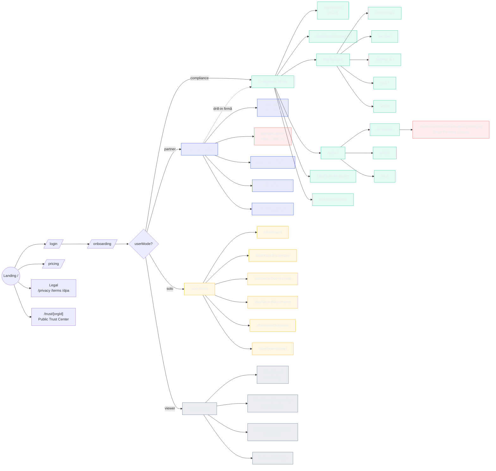

---

## 3. FLOW UTILIZATOR PRINCIPAL — DIANA 9:15 AM (JTBD #1)

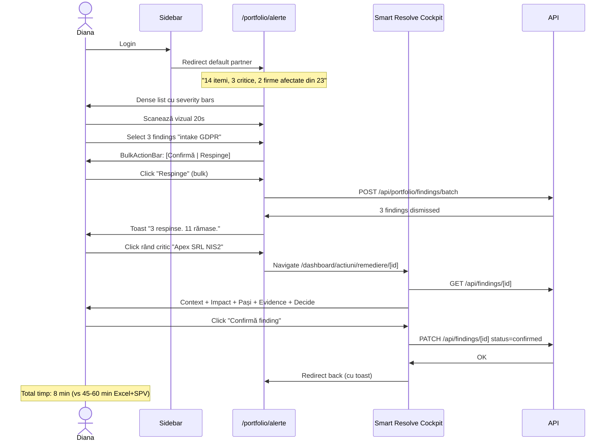

---

## 4. REDIRECTS LEGACY → CANONIC (22 rute)

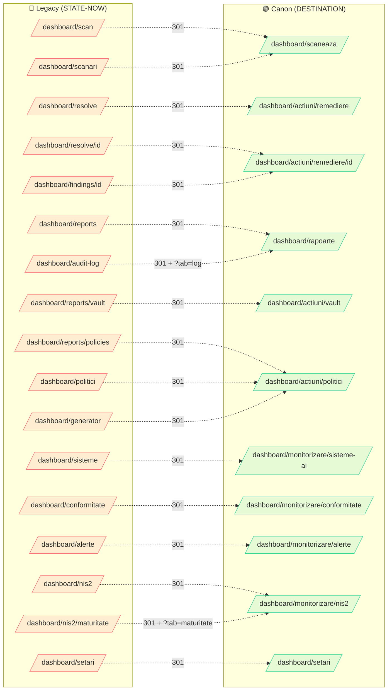

---

## 5. TABEL COMPARATIV — CURENT vs TARGET

| Aspect | CURENT (cod) | TARGET (DESTINATION) | Diff |
|---|---|---|---|
| **Sidebar Partner** | 1 secțiune "Flux principal" cu 5 itemi + portfolio mix | 2 secțiuni distincte: PORTOFOLIU (5) + FIRMĂ (7) + org dropdown | Refactor nav-config |
| **Sidebar Compliance** | Identic cu Partner | Per-firmă fără PORTOFOLIU | Split logic per mode |
| **Sidebar Solo** | 6 itemi dar nav-config inconsistent | 6 itemi simplificați (De rezolvat + Documente colapsate) | Rute noi: `/de-rezolvat`, `/documente` |
| **Sidebar Viewer** | Nu e implementat distinct | 4 itemi read-only | Refactor + ghid filter |
| **Aterizare Partner** | `/dashboard` | `/portfolio` | Redirect în login |
| **Aterizare Compliance/Solo** | `/dashboard` | `/dashboard` ✅ | OK |
| **Ruta resolve canonică** | `/dashboard/resolve/[id]` | `/dashboard/actiuni/remediere/[id]` | Redirect 301 |
| **Rute cu prefix `/actiuni`** | Nu există | `/dashboard/actiuni/remediere \| politici \| vault` | Mutare cod |
| **Rute cu prefix `/monitorizare`** | Nu există | `/dashboard/monitorizare/conformitate \| furnizori \| sisteme-ai \| nis2 \| alerte` | Mutare cod |
| **Applicability gating** | Toți văd toate | `sisteme-ai` + `nis2` doar dacă `applicability.{aiAct\|nis2}` | Wire check în nav-config |
| **Rute orfane** | 14 pagini funcționale fără link | 0 (toate linked sau șterse) | DELETE + REDIRECT |
| **Rute RO duplicate** | 7 (`/setari`, `/scanari`...) | 0 (doar canonic RO) | Șterge duplicate, redirect |
| **Breadcrumb universal** | Inconsistent | Peste tot (`/dashboard/*`, `/portfolio/*`) | Wire `DashboardBreadcrumb` |
| **Label "Firma activa"** | Actualul label | "FIRMĂ" (per canon) | Rename |

---

## 6. SCHIMBĂRI ROUTE — VIEW DE ÎNALTĂ ALTITUDINE

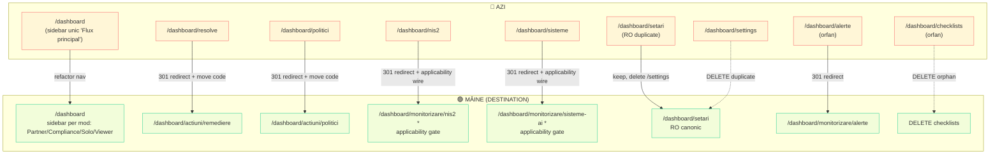

---

## 7. IMPLEMENTARE — ORDINE CONCRETĂ (fără UI changes)

Pașii de implementare IA (strict structure, zero vizual):

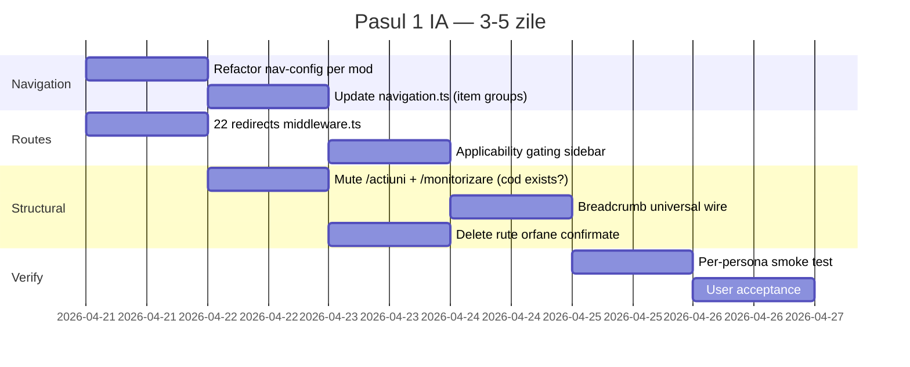

---

## 8. DECIZII DE CONFIRMAT ÎNAINTE DE IMPLEMENTARE

Pentru a implementa corect IA-ul, am nevoie de răspuns pe:

1. **Aterizare Partner**: DESTINATION zice `/portfolio`. Azi login redirect la `/dashboard`. **Confirmi** că Partner aterizează pe `/portfolio`?
2. **`/dashboard/setari` (RO) vs `/dashboard/settings` (EN)**: canon zice RO canonic. **Confirmi** că ștergem varianta EN + redirect?
3. **Sub-rute `/actiuni/*` și `/monitorizare/*`**: aceste directoare NU EXISTĂ încă în cod. **Confirmi** că mut fișierele existente (ex: `app/dashboard/resolve/` → `app/dashboard/actiuni/remediere/`)?
4. **Mod Solo — rute colapsate `/de-rezolvat` + `/documente`**: aceste rute noi nu există. **Confirmi** că le creez?
5. **Org dropdown în sidebar Partner**: unde apare concret vizual? DESTINATION zice `FIRMA: [LogiTrans SRL ▼]` — e un dropdown care schimbă firma activă. **Confirmi** că dropdown-ul îl păstrăm ca în cod actual (WorkspaceModeSwitcher) sau îl rescriem simplu?
6. **Rute orfane confirmate pentru ștergere**: `/dashboard/checklists`, `/dashboard/asistent` (deja șters), `/dashboard/alerte` (va fi redirect?) — **confirmi lista finală** din `FAZA-1-DECISION-MATRIX.md`?

---

## 9. REZUMAT — CE VA FI DIFERIT

Un user care intră azi vs după Pasul 1 IA:

| User action | Azi | După IA rework |
|---|---|---|
| Diana face login | Aterizează `/dashboard` | Aterizează `/portfolio` |
| Diana deschide sidebar | "Flux principal" cu 5 itemi generic | 2 secțiuni distincte: PORTOFOLIU + FIRMĂ (cu dropdown) |
| Diana dă click pe "Inbox" | `/portfolio/alerts` (inconsistent EN label "Schimbări detectate" în RO) | `/portfolio/alerte` (RO canonic) |
| User tastează `/dashboard/resolve/abc` | Merge direct la pagina veche | Redirect 301 la `/dashboard/actiuni/remediere/abc` |
| Radu (compliance) loghează | Vede exact același sidebar ca Diana | Vede sidebar fără PORTOFOLIU + fără org dropdown |
| Org fără NIS2 (applicability) | Vede NIS2 în sidebar (nu poate face nimic) | NU vede NIS2 în sidebar |
| Solo user vede `/dashboard/actiuni/remediere` | Sidebar cu 5 itemi + resolve detail | Sidebar simplificat 6 itemi cu "De rezolvat" unificat |

**Schimbarea vizuală nulă** (zero UI changes în Pasul 1 — doar structură, rute, nav). Vizualul vine abia în Pasul 3 UI.

---

---

## 10. USER JOURNEYS CAP-COADĂ — PE FIECARE PERSONA

> Flow-uri end-to-end de la **achiziție** (primul contact cu produsul) până la **offboarding** (ce face ultimul). Fiecare pas include **rută exactă** + **ce face user-ul** + **ce vede**.

---

### 10.1 DIANA — PARTNER CONSULTANT (sweet spot €149/lună)

**Context**: Diana (35 ani, contabil CECCAR cu 20 clienți SRL), află de CompliAI din grupul FB Contabili România (50k+). Vrea să monetizeze compliance ca serviciu rebill.

#### STADIUL 1 — ACHIZIȚIE (pre-signup)
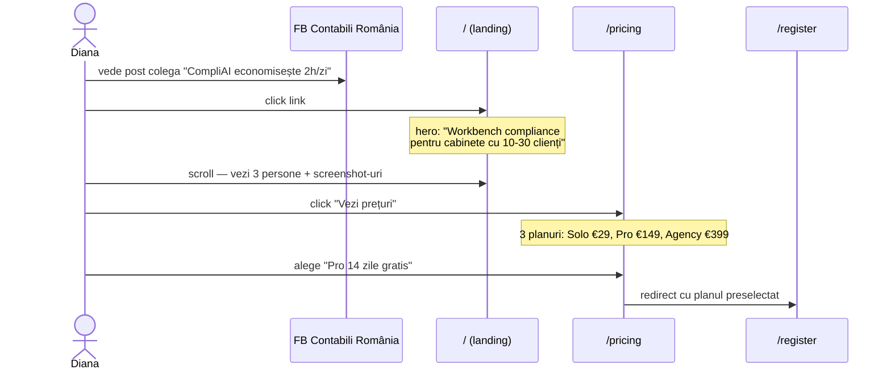

**Pași concreti**:
1. `/` — landing page: hero, 3 persone, testimoniale, CTA "Încearcă gratis 14 zile"
2. `/pricing` — tabel 3 planuri, FAQ, buton "Începe Pro gratuit"
3. Click CTA → `/register?plan=partner-pro-trial`

#### STADIUL 2 — SIGNUP + ONBOARDING (primele 10 min)
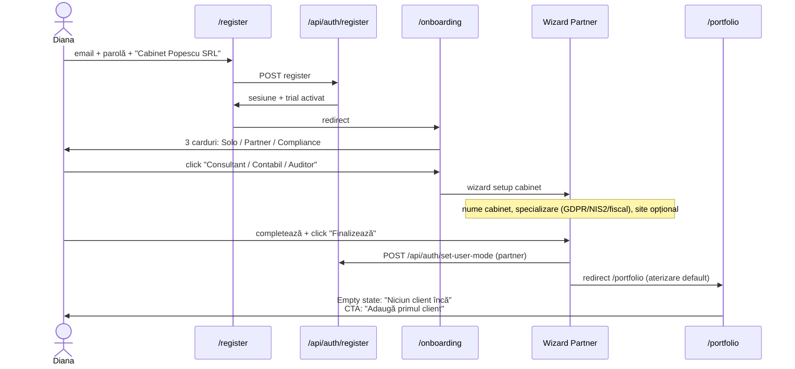

**Pași**:
1. `/register` — form 3 câmpuri. Submit → API register + auto-login.
2. `/onboarding` — 3 carduri persona. Click Partner.
3. Wizard 2 pași: nume cabinet, specializare. Submit.
4. `/api/auth/set-user-mode` → `partner`. Redirect `/portfolio`.
5. `/portfolio` empty state cu CTA "+ Adaugă firmă".

#### STADIUL 3 — PRIMUL CLIENT (următoarele 5 min)
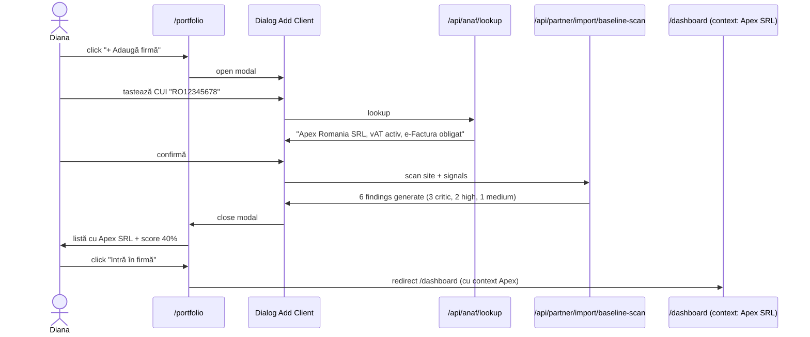

**Pași**:
1. `/portfolio` → click "Adaugă firmă"
2. Dialog: tastează CUI → API `/api/anaf/lookup` populează orgName, vatActive, efacturaRegistered
3. Click "Confirmă" → API baseline scan → findings generate
4. Listă updated cu Apex SRL + score
5. Click pe rând → `/dashboard` cu context Apex

#### STADIUL 4 — BULK IMPORT 19 CLIENȚI (o singură dată)
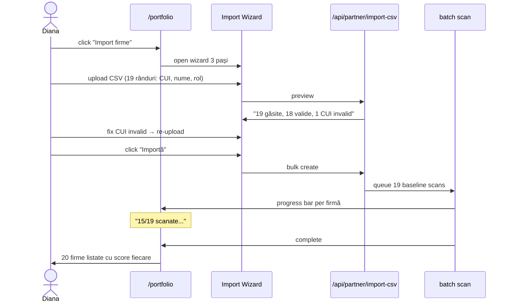

**Pași**:
1. `/portfolio` → "Import firme"
2. Upload CSV (template vine cu aplicația)
3. Preview + fix errors → confirm
4. Background batch scan (5-10 min)
5. Portfolio cu 20 firme

#### STADIUL 5 — DAILY MORNING RITUAL (9:15 AM, 8 min)
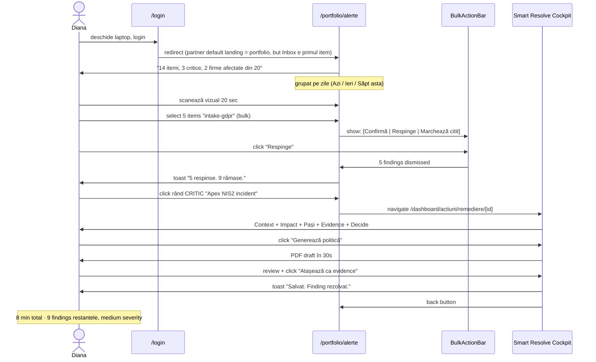

**Pași**:
1. `/login` → `/portfolio/alerte` (auto-redirect Partner)
2. Triage dense list cu keyboard shortcuts (J/K navigate, X select, E enter)
3. Bulk action pe 5 irrelevant findings
4. Click pe 1 critic → `/dashboard/actiuni/remediere/[id]`
5. Cockpit: confirm + generate doc + attach → resolve
6. Back la `/portfolio/alerte`. Diana închide laptop.

#### STADIUL 6 — WEEKLY REVIEW (vineri, 30 min)
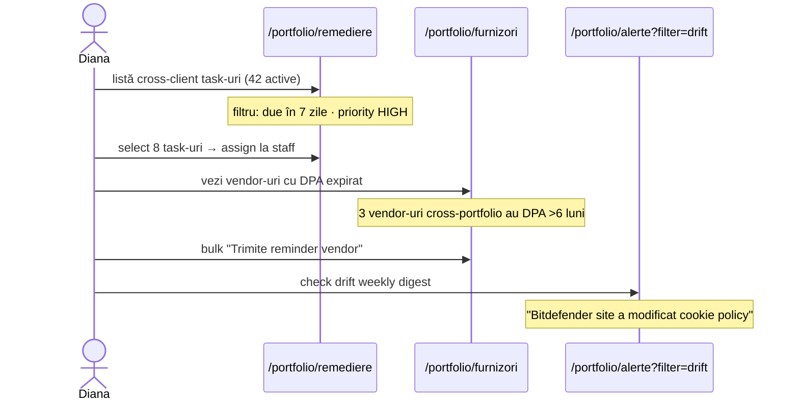

#### STADIUL 7 — MONTHLY BATCH EXPORT (sfârșit lună, 1h)
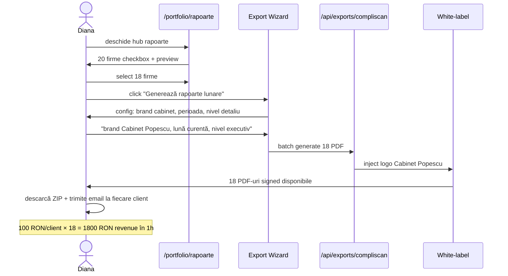

#### STADIUL 8 — CLIENT AUDIT ANSPDCP (incidental, 2h)
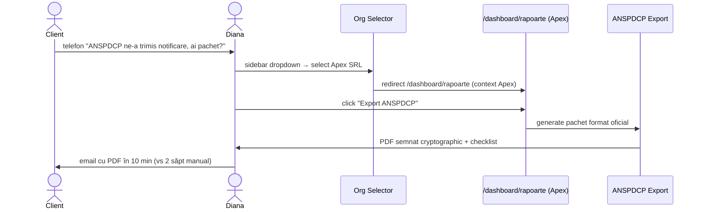

#### STADIUL 9 — BILLING + ACCOUNT (rar)
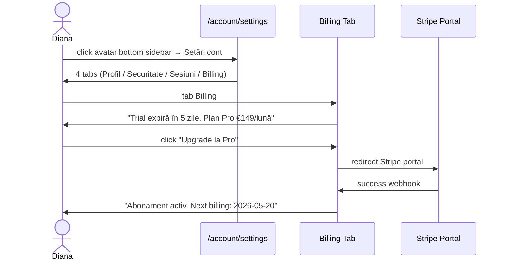

#### STADIUL 10 — OFFBOARDING (rare, GDPR)
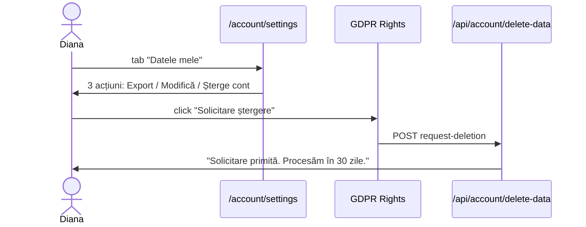

**Total JTBD-uri atinse**: 10 stadii × multiple flow-uri. **Majoritatea timpului** în STADIUL 5 (Daily 8 min), STADIUL 6 (Weekly 30 min), STADIUL 7 (Monthly 1h).

---

### 10.2 RADU — COMPLIANCE DPO INTERN (typically employed at SRL/SA €500K+ revenue)

**Context**: Radu (38 ani, DPO la Acme SRL — 80 angajați, sector fintech). Vine pe CompliAI prin management (manager i-a cumpărat licența ca să-l ajute). NU el cumpără, dar el e user-ul zilnic.

#### STADIUL 1 — ACHIZIȚIE + ACTIVARE (0 din partea Radu)
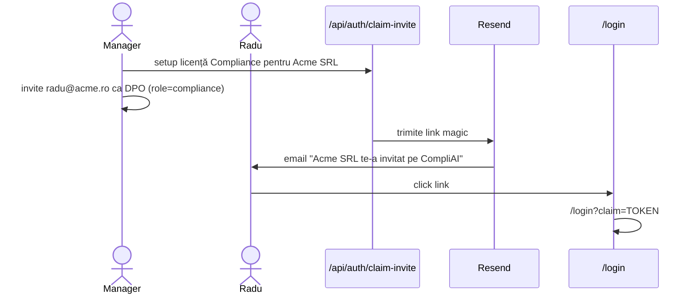

#### STADIUL 2 — ONBOARDING PRIMULUI LOGIN (10 min)
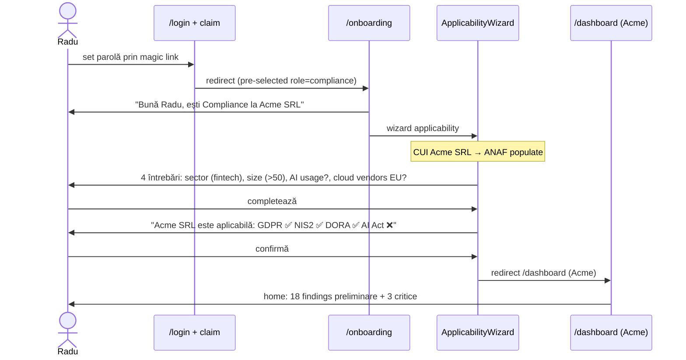

#### STADIUL 3 — PRIMUL SCAN COMPLET (30 min)
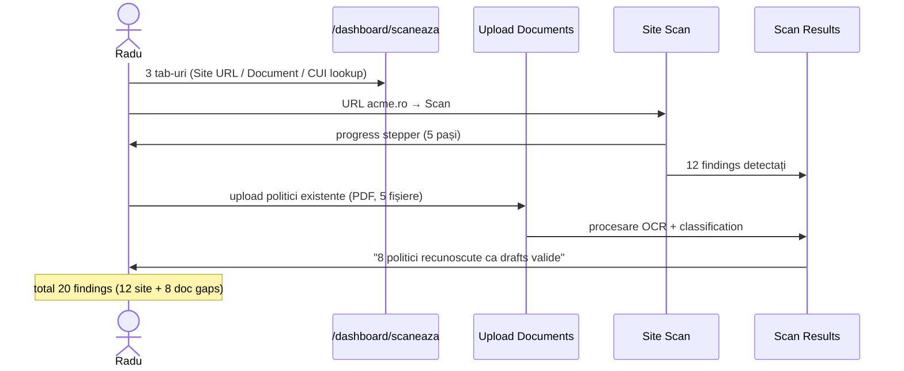

#### STADIUL 4 — DAILY TRIAGE (15 min)
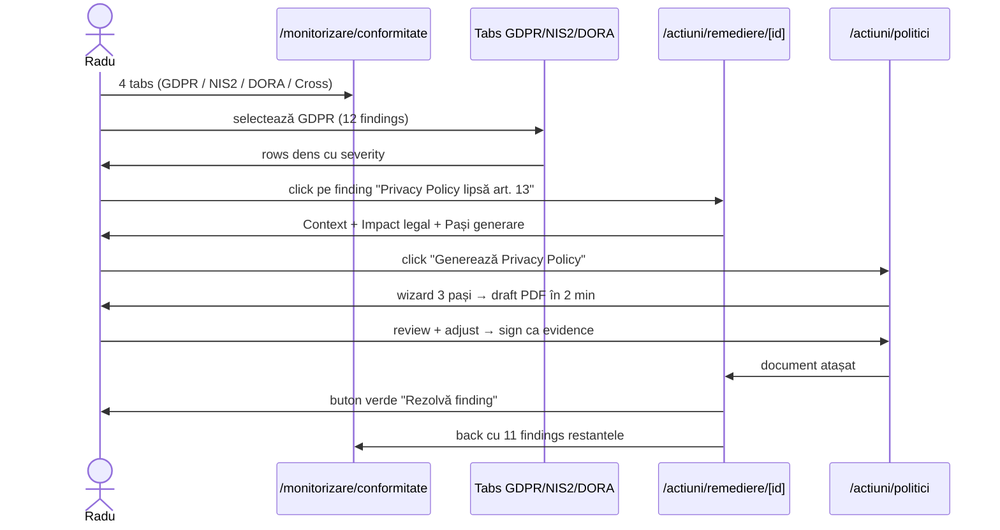

#### STADIUL 5 — NIS2 ASSESSMENT (săptămânal, 1h)
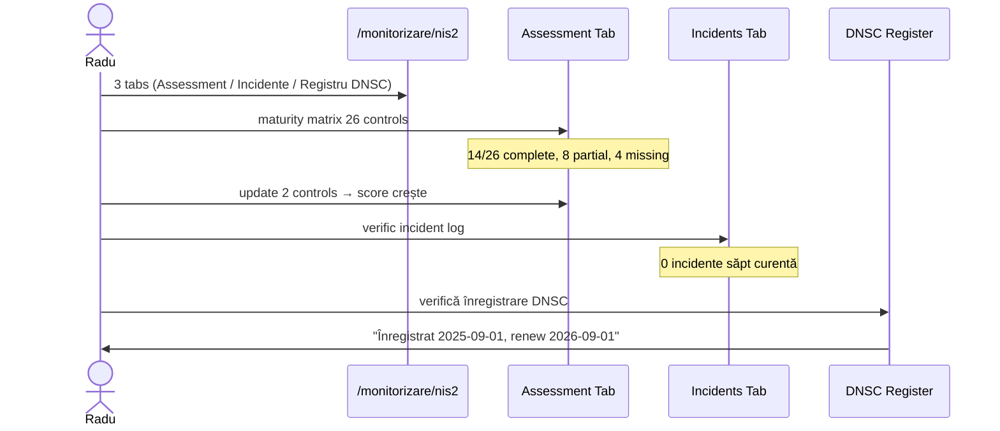

#### STADIUL 6 — DSAR HANDLING (incidental, 2h per cerere)
```mermaid
sequenceDiagram
    actor Angajat
    actor Radu
    participant DSAR as /monitorizare/alerte (DSAR tab)
    participant Response as DSAR Response
    participant Export as Export Pack

    Angajat->>Radu: email "cer toate datele mele conform Art. 15"
    Radu->>DSAR: creează cerere DSAR nouă
    DSAR->>Radu: wizard: tip cerere, subject identification, deadline 30 zile
    Radu->>Response: colectează date (HR system, payroll, CompliAI context)
    Response->>Export: generate DSAR pack PDF
    Export->>Radu: pachet semnat + checklist art. 15
    Radu->>Angajat: email cu pachet
```

#### STADIUL 7 — AUDIT ANSPDCP (ad-hoc, cel mai stressor moment)
```mermaid
sequenceDiagram
    actor Authority as ANSPDCP
    actor Radu
    participant Rapoarte as /dashboard/rapoarte
    participant AuditExport as Audit Pack
    participant Vault as /actiuni/vault

    Authority->>Radu: notificare "Audit programat în 10 zile"
    Radu->>Rapoarte: click "Generează pachet ANSPDCP"
    Rapoarte->>AuditExport: collect all evidence + policies
    AuditExport->>Radu: PDF signed cu format ANSPDCP
    Radu->>Vault: review pachet vs checklist oficial
    Vault->>Radu: 95% complet. Gap: "DPIA high-risk processing lipsă"
    Radu->>Radu: fix gap cu /actiuni/politici → regenerate
    Radu->>Authority: trimite pachet cu 5 zile înainte
```

#### STADIUL 8 — MONTHLY REPORT to CEO (1h)
```mermaid
sequenceDiagram
    actor CEO
    actor Radu
    participant Report as /dashboard/rapoarte
    participant Dashboard as executive summary

    Radu->>Report: click "Raport executiv lunar"
    Report->>Radu: config: perioada, audience (board), format
    Report->>Dashboard: PDF 2 pagini
    Note over Dashboard: scor conformitate, risk heat map, 3 highlights
    Radu->>CEO: email raport
```

#### STADIUL 9 — SETĂRI + TEAM (rar)
```mermaid
sequenceDiagram
    actor Radu
    participant Setari as /dashboard/setari
    participant Membri as Membri Tab
    participant Account as /account/settings

    Radu->>Setari: 9 tabs
    Radu->>Membri: invită 2 colegi ca Viewer
    Membri->>Radu: invites sent
    Radu->>Account: personal profile (optional)
```

**JTBD-uri atinse**: Radu are ~8 flow-uri distincte. **Cel mai stressant**: audit ANSPDCP (STADIUL 7). **Cel mai frecvent**: daily triage (STADIUL 4).

---

### 10.3 MIHAI — SOLO SME OWNER (€29-49/lună, sweet spot SRL <10 angajați)

**Context**: Mihai (42 ani, patron Bistro Mihai SRL — 3 angajați, revenue €180K/an). Nu e pasionat de compliance, dar a primit notificare ANAF despre e-Factura. Se autoeducă, căută "GDPR SRL ieftin".

#### STADIUL 1 — ACHIZIȚIE (SEO + freemium entry)
```mermaid
sequenceDiagram
    actor Mihai
    participant Google as Google Search
    participant Landing as /
    participant Pricing as /pricing
    participant Register as /register

    Mihai->>Google: "GDPR politică simplă SRL gratis"
    Google->>Landing: top result "CompliAI — compliance pentru SRL-uri mici"
    Landing->>Mihai: hero + 3 persone → click "Solo"
    Landing->>Pricing: vezi Solo €29/lună (sau 14 zile gratis)
    Mihai->>Register: click "Încearcă gratis"
```

#### STADIUL 2 — ONBOARDING SIMPLIFICAT (5 min)
```mermaid
sequenceDiagram
    actor Mihai
    participant Register as /register
    participant Onboarding as /onboarding
    participant Applicability as ApplicabilityWizard
    participant Dashboard as /dashboard

    Mihai->>Register: email + parolă + "Bistro Mihai SRL"
    Register->>Onboarding: redirect
    Onboarding->>Mihai: 3 carduri
    Mihai->>Onboarding: click "Proprietar / Manager"
    Onboarding->>Applicability: wizard simplificat
    Applicability->>Mihai: doar 3 întrebări (sector=HoReCa, size=<10, cloud EU=yes)
    Applicability->>Mihai: "Aplicabil: GDPR + e-Factura. AI Act ❌, NIS2 ❌"
    Applicability->>Dashboard: redirect /dashboard (simplified)
```

#### STADIUL 3 — PRIMUL SCAN (5 min, "aha" moment)
```mermaid
sequenceDiagram
    actor Mihai
    participant Scan as /dashboard/scaneaza
    participant Results
    participant DeRezolvat as /dashboard/de-rezolvat

    Mihai->>Scan: input URL "bistromihai.ro"
    Scan->>Results: 4 findings detectate
    Note over Results: 1 critic (cookie consent lipsă)<br/>2 medium (privacy gaps)<br/>1 low (e-Factura setup)
    Results->>DeRezolvat: auto-redirect "De rezolvat"
    DeRezolvat->>Mihai: 4 items ordonate după severitate
    Note over Mihai: "Oh, deci atât?" - primul "aha"
```

#### STADIUL 4 — REZOLVĂ PRIMUL FINDING (10 min)
```mermaid
sequenceDiagram
    actor Mihai
    participant DeRezolvat as /dashboard/de-rezolvat
    participant Guided as Guided Wizard
    participant Doc as Generator

    Mihai->>DeRezolvat: click "Cookie consent lipsă"
    DeRezolvat->>Guided: wizard "Hai să rezolvăm pas cu pas"
    Note over Guided: UI foarte prietenos, explicații simple
    Guided->>Mihai: "Avem nevoie să plasezi un banner pe site"
    Guided->>Mihai: 2 opțiuni: Copy-paste code / "Generez politică cookie"
    Mihai->>Doc: click "Generează"
    Doc->>Mihai: PDF politică cookie + HTML snippet banner
    Mihai->>Mihai: copy-paste în site, upload PDF
    Guided->>Mihai: "Excelent! Finding rezolvat."
    Note over Mihai: primul win concret
```

#### STADIUL 5 — DOCUMENTE (săpt 1, 20 min)
```mermaid
sequenceDiagram
    actor Mihai
    participant Documente as /dashboard/documente
    participant Gen as Politici Generator

    Mihai->>Documente: hub unificat (politici + scans)
    Mihai->>Documente: "Generează Privacy Policy"
    Gen->>Mihai: 3 întrebări simple: website? newsletter? contact form?
    Gen->>Mihai: PDF draft 4 pagini
    Mihai->>Mihai: upload pe site
    Gen->>Documente: atașată ca evidence
```

#### STADIUL 6 — e-FACTURA SETUP (30 min, STADIUL SINGUR COMPLEX)
```mermaid
sequenceDiagram
    actor Mihai
    participant DeRezolvat as /dashboard/de-rezolvat
    participant Setup as e-Factura Setup
    participant ANAF as /api/anaf/connect

    Mihai->>DeRezolvat: click "e-Factura nu e activă"
    DeRezolvat->>Setup: wizard setup ANAF SPV
    Setup->>Mihai: 4 pași: auth cert ANAF, OAuth connect, verify, first factura
    Mihai->>ANAF: OAuth flow real
    ANAF->>Setup: success
    Setup->>Mihai: "Conectat. Facturile tale sunt monitorizate acum."
```

#### STADIUL 7 — MONTHLY SELF-CHECK (10 min, rar)
```mermaid
sequenceDiagram
    actor Mihai
    participant Rapoarte as /dashboard/rapoarte
    participant Snapshot

    Mihai->>Rapoarte: click "Status conformitate"
    Rapoarte->>Snapshot: PDF simplu 1 pagină
    Note over Snapshot: "Ești conform 85%. Acțiuni rămase: 3 (niciuna critică)"
    Snapshot->>Mihai: email lunar automat
```

#### STADIUL 8 — UPGRADE OPPORTUNITY (1-3 luni după)
```mermaid
sequenceDiagram
    actor Mihai
    participant DeRezolvat as /dashboard/de-rezolvat
    participant PlanGate as Plan Gate Modal
    participant Stripe

    Mihai->>DeRezolvat: încearcă să adauge un employee DPA
    DeRezolvat->>PlanGate: "Plan Solo nu include multi-user. Upgrade?"
    PlanGate->>Mihai: 3 opțiuni: Pro €149 / Agency / Skip
    Mihai->>Stripe: upgrade (sau skip)
```

#### STADIUL 9 — OFFBOARDING / DEACTIVATE (rare)
```mermaid
sequenceDiagram
    actor Mihai
    participant Account
    participant API

    Mihai->>Account: tab "Abonament"
    Account->>Mihai: click "Dezabonează-te"
    Mihai->>API: POST cancel
    API->>Mihai: "Abonament anulat. Acces până la 2026-05-20."
```

**JTBD-uri Mihai**: foarte puține, dar frequente. **Aha moment-ul crucial**: primul finding rezolvat cu wizard guided (STADIUL 4). Dacă asta merge smooth → conversie la paid. Dacă nu → churn.

---

## 11. OBSERVAȚII CROSS-PERSONA

| Aspect | Diana (Partner) | Radu (Compliance) | Mihai (Solo) |
|---|---|---|---|
| **Timp onboarding** | 10 min (wizard partner) | 10 min (applicability + invited) | 5 min (simplificat) |
| **Primul "aha"** | Bulk dismiss 5 findings | Primul scan complet cu 20 findings | Primul finding rezolvat cu wizard |
| **Frecvență zilnic** | 10 min (9:15 AM triage) | 15 min (GDPR/NIS2 tabs) | 0 (intră săpt o dată) |
| **Frecvență săptămânal** | 30 min (remediere + vendor) | 1h (NIS2 assess + incidents) | 10 min (check status) |
| **Frecvență lunar** | 1h (batch reports revenue) | 1h (CEO report) | 5 min (snapshot email) |
| **Moment critic** | Client audit (30 min save) | Audit ANSPDCP (2 săpt save) | e-Factura setup (blocker ANAF) |
| **Valoarea cheie** | Revenue rebill 100-300 RON/client × 20 | Audit-ready în 1 click vs 2 săpt | Compliance fără stres în 30 min/lună |
| **Paginile ce ating** | 8 rute principale | 10 rute principale | 5 rute simplificate |

---

## 12. CE TREBUIE FIXAT ÎN IA PENTRU FLOW-URILE DE MAI SUS

| User | Flow | Ce lipsește acum (blocher) |
|---|---|---|
| Diana | STADIUL 1 (achiziție) | Landing + Pricing sunt funcționale. OK. |
| Diana | STADIUL 5 (daily) | `/portfolio/alerte` există ca `/portfolio/alerts` — redenumire necesară + bulk actions wire |
| Diana | STADIUL 6 (weekly) | `/portfolio/remediere` nu există în rute (e `/portfolio/tasks`) — redenumire |
| Diana | STADIUL 7 (monthly) | `/portfolio/rapoarte` e `/portfolio/reports` — redenumire |
| Radu | STADIUL 2 (onboarding) | Claim invite flow există dar nu pre-populează mode=compliance automat |
| Radu | STADIUL 4 (daily) | `/monitorizare/conformitate` nu există ca rută (e `/dashboard/conformitate`) |
| Radu | STADIUL 5 (NIS2) | `/monitorizare/nis2` nu există (e `/dashboard/nis2`) |
| Radu | STADIUL 7 (audit ANSPDCP) | Endpoint există (`/api/exports/anspdcp-pack/[orgId]`) dar format nevalidat juridic |
| Mihai | STADIUL 3 (primul scan) | `/dashboard/de-rezolvat` (rută simplificată Solo) NU EXISTĂ — de creat |
| Mihai | STADIUL 5 (docs) | `/dashboard/documente` hub simplificat NU EXISTĂ — de creat |
| Mihai | STADIUL 6 (e-Factura) | Setup wizard complet funcțional |

**Concluzie IA Pasul 1**: majoritatea flow-urilor sunt blocate de rute RO nepotrivite (nu există `/portfolio/alerte` ca redirect de la `/portfolio/alerts`, etc.). După redirect map din §4 + rute noi Solo, toate 3 persone pot parcurge flow-urile integral.

---

> **END IA-TARGET-DIAGRAM v1.1 (cu User Journeys cap-coadă)** — 2026-04-20.
> Folosit pentru review înainte de implementare Pasul 1. După OK, implementez.
